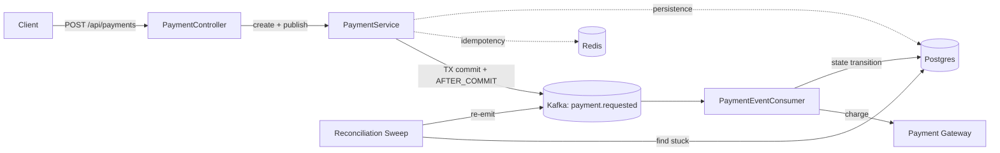

# Payment Processing System

An event-driven payment processing service built with Spring Boot, Kafka, Postgres, and Redis. Demonstrates production-grade patterns for handling money: idempotency, state machines, distributed event processing, reconciliation, and observability.

> **Status:** v1.0.0 — feature-complete portfolio project.
> **Author:** Aryan ([github.com/Aryan-Singh-Tomar/](https://github.com/Aryan-Singh-Tomar/))

---

## What This Is

A payment service that accepts payment requests via REST, processes them asynchronously through Kafka, and integrates with a (simulated) payment gateway. Designed to be safe at the boundary where money meets distributed systems: same request never charges twice, partial failures are recoverable, and every transition is observable.

Built primarily as a learning project to deeply explore the patterns required when you're building anything that handles real money or critical state.

---

## Key Features

- **Two-layer idempotency.** Client-supplied idempotency keys checked in both Redis and Postgres. Same request always produces the same outcome — never a duplicate charge.
- **Strict state machine.** Payments transition through PENDING → PROCESSING → SUCCESS/FAILED/UNKNOWN. Invalid transitions are rejected at both application and database layers.
- **Event-driven processing.** API returns immediately with status PENDING; Kafka consumer drives the payment through its lifecycle asynchronously.
- **Reconciliation sweeper.** A scheduled job catches payments stuck in non-terminal states (e.g., after a crash mid-processing) and re-emits events to recover them.
- **Defense in depth.** Pessimistic database locks, optimistic version checks, partial unique indexes, and dedup tables work together — no single failure point can corrupt state.
- **Production-grade observability.** Spring Boot Actuator probes (liveness, readiness), structured JSON logs with sensitive-field masking, interactive Swagger UI.
- **Containerized stack.** Single `docker compose up` brings up the entire system with proper healthcheck-gated startup ordering.

---

## Tech Stack

- **Language:** Java 17
- **Framework:** Spring Boot 3.3.4
- **Messaging:** Apache Kafka 3 (KRaft mode, no Zookeeper)
- **Database:** PostgreSQL 16 + Flyway migrations
- **Cache / Idempotency store:** Redis 7
- **Build:** Maven
- **Containerization:** Docker, Docker Compose
- **API docs:** OpenAPI 3 / springdoc / Swagger UI
- **Testing:** JUnit 5, Testcontainers (real Postgres, Redis, Kafka in CI)

---

## Quickstart

You need only Docker installed. Java, Maven, Postgres, etc. — none of that is required on your machine.

```bash
git clone https://github.com/your-username/payment-system.git
cd payment-system
docker compose up --build
```

That single command:
- Builds the application image from the Dockerfile.
- Starts Postgres, Redis, and Kafka with healthchecks.
- Waits for each dependency to be healthy.
- Starts the application.

Within ~60 seconds, the system is fully up. Verify:

```bash
curl http://localhost:8090/actuator/health
```

Should return:
```json{
"status": "UP",
"components": { "db": { "status": "UP" }, "redis": { "status": "UP" }, ... }
}
```

Open Swagger UI at [http://localhost:8090/swagger-ui.html](http://localhost:8090/swagger-ui.html) to explore and test the API interactively.

---

## Try A Payment End-To-End

```bash
# Insert a test order
docker exec -i payment-postgres psql -U payments -d payments -c \
  "INSERT INTO orders (id, customer_id, amount, currency) VALUES ('11111111-1111-1111-1111-111111111111', 'CUST-001', 1500.00, 'INR');"

# Create a payment for that order
curl -X POST http://localhost:8090/api/payments \
  -H "Content-Type: application/json" \
  -d '{
    "orderId": "11111111-1111-1111-1111-111111111111",
    "amount": 1500.00,
    "currency": "INR",
    "idempotencyKey": "demo-payment-001"
  }'

# Wait a moment, then verify it processed
docker exec -i payment-postgres psql -U payments -d payments -c \
  "SELECT id, status, gateway_payment_id FROM payments WHERE idempotency_key = 'demo-payment-001';"
```

Status should be `SUCCESS` (85%), `FAILED` (10%), or `UNKNOWN` (5%) — the fake gateway is configured with realistic failure distributions.

---

## Architecture

## Payment Processing Flow

```text
┌──────────┐      POST /api/payments       ┌─────────────────────┐
│  Client  │ ─────────────────────────────► │  PaymentController  │
└──────────┘ ◄────── 202 Accepted ───────── └──────────┬──────────┘
                     payment PENDING                  │
                                                      │ create + publish
                                                      ▼
                                      ┌──────────────────────────┐
                                      │  PaymentService (TX)     │
                                      │  - Idempotency check     │
                                      │    Redis + PostgreSQL    │
                                      │  - State machine check   │
                                      │  - Insert payment row    │
                                      │  - Publish AFTER_COMMIT  │
                                      └────────────┬─────────────┘
                                                   │
                                                   ▼
                                      ┌──────────────────────────┐
                                      │  Kafka topic             │
                                      │  payment.requested       │
                                      └────────────┬─────────────┘
                                                   │
                                                   ▼
┌────────────────────────────────────────────────────────────────────┐
│  PaymentEventConsumer                                               │
│  - Dedup check using processed_events table                         │
│  - Move payment from PENDING → PROCESSING using pessimistic lock     │
│  - Call payment gateway                                             │
│  - Move payment from PROCESSING → SUCCESS / FAILED / UNKNOWN        │
└────────────────────────────────────────────────────────────────────┘

┌────────────────────────────────────────────────────────────────────┐
│  Reconciliation Sweeper                                             │
│  Runs every 60 seconds                                              │
│  - Finds payments stuck in PENDING / PROCESSING                     │
│  - Re-emits events to recover them                                  │
└────────────────────────────────────────────────────────────────────┘
```


State storage:
- **Postgres** — source of truth for payments, orders, processed_events. ACID guarantees.
- **Redis** — idempotency response cache (fast hot path before hitting DB).
- **Kafka** — event log between API and processing layers; enables async, partitioning, and retry topics.

---

## Design Decisions

This section is the heart of the README. Each entry is a hard problem I encountered and how I solved it.

### 1. Idempotency Across Two Boundaries

**Problem:** Network retries, client double-clicks, and at-least-once Kafka delivery can all cause the same payment request to arrive multiple times. The system must charge exactly once.

**Solution:** Two-layer idempotency.
- **API boundary:** Client supplies an `idempotencyKey`. PaymentService checks Redis first (fast); on miss, checks Postgres unique constraint on `(idempotency_key)`. The constraint ensures atomicity: even if two threads race past the cache check, only one INSERT succeeds.
- **Kafka boundary:** Consumer maintains a `processed_events` table keyed by event ID. Before processing, it checks this table. After processing, it records the event ID. Duplicate Kafka deliveries hit the dedup check and skip.

### 2. Idempotency-Reconciliation Conflict

**Problem:** The `processed_events` dedup table is also a barrier to reconciliation. When the reconciliation sweep re-emits events for stuck payments, the consumer sees the event ID in `processed_events` and skips it — the very re-processing we want is prevented by the dedup.

**Solution:** Explicit `unmark()` operation. The reconciliation service deletes the row from `processed_events` (and evicts the Redis cache entry) before re-publishing. Documented trade-off: if the original processing actually succeeded but didn't record `processed_at`, the unmark allows double-execution. Mitigated in production by gateway-side idempotency keys; for this project, the risk is documented in `docs/reconciliation-design.md`.

### 3. State Machine Enforced At Two Layers

**Problem:** A payment must not transition from SUCCESS back to PENDING, regardless of bugs or race conditions.

**Solution:** State machine rules checked in Java (`PaymentStateMachine`) AND enforced by database constraints (partial unique indexes ensuring at most one non-failed payment per order). Two failure modes have to occur simultaneously to corrupt state.

### 4. Async Boundary At The API

**Problem:** Calling the payment gateway synchronously from the HTTP request couples request latency to gateway response time. A 5-second gateway call holds an HTTP connection open. Worse, if the gateway times out, the API has to decide what to tell the client — and a wrong answer is unrecoverable.

**Solution:** Kafka in the middle. POST creates the payment and publishes an event; consumer calls the gateway later. API returns 202 with status PENDING immediately. Client gets a fast acknowledgment; the long-running work happens elsewhere.

### 5. Reconciliation As A Safety Net

**Problem:** What if the consumer crashes mid-processing, after starting the state transition but before recording the result? The payment is stuck in PROCESSING forever.

**Solution:** A scheduled sweeper job finds payments older than a threshold in non-terminal states and re-emits events. Combined with the `unmark()` pattern, this catches and recovers stuck payments without operator intervention. The trade-off: PROCESSING is ambiguous (gateway might have already been called), so this design accepts a small double-execution risk in exchange for automatic recovery. Production fix would use gateway-side query-by-payment-id to determine actual state before retry.

### 6. Configuration Externalized For Multi-Environment Deployment

**Problem:** Same JAR needs to run in local dev, staging, and production with different DB hosts, Kafka brokers, etc.

**Solution:** `application.yaml` provides defaults for local dev (`localhost`). Docker Compose overrides via environment variables (`SPRING_DATASOURCE_URL`, etc.) for containerized deployment. No code changes between environments; the same image runs everywhere with config injected at deploy time.

---

## API Reference

Interactive Swagger UI: [http://localhost:8090/swagger-ui.html](http://localhost:8090/swagger-ui.html)

Key endpoints:

| Method | Path | Purpose |
|---|---|---|
| `POST` | `/api/payments` | Create a payment (idempotent via `idempotencyKey`) |
| `GET` | `/actuator/health` | Overall service health |
| `GET` | `/actuator/health/liveness` | Kubernetes-style liveness probe |
| `GET` | `/actuator/health/readiness` | Kubernetes-style readiness probe |
| `GET` | `/actuator/metrics` | JVM, HTTP, Kafka, and connection pool metrics |
| `GET` | `/v3/api-docs` | Machine-readable OpenAPI spec |

---

## Observability

- **Structured JSON logs** — Enable with `SPRING_PROFILES_ACTIVE=json`. Each log line is a queryable JSON object ready for Datadog/Splunk/ELK.
- **Sensitive field masking** — Idempotency keys and gateway transaction IDs are masked in logs (`abcd****wxyz`) to prevent leakage through log shipping.
- **Spring Boot Actuator** — Health, liveness, readiness, info, and metrics endpoints. JVM metrics, HTTP request timing, Kafka client metrics, Hikari connection pool stats all collected automatically.
- **OpenAPI / Swagger UI** — Self-documenting API with example values and error code documentation.

---

## Project Structure

```text
payment-system/
├── src/main/java/com/payment/paymentsystem/
│   ├── config/                  # OpenAPI and other config beans
│   ├── controller/              # REST endpoints
│   ├── dto/                     # Request/response shapes with @Schema annotations
│   ├── entity/                  # JPA entities
│   ├── event/                   # Kafka event types
│   ├── exception/               # GlobalExceptionHandler
│   ├── gateway/                 # Simulated payment gateway
│   ├── kafka/                   # Producer + consumer
│   ├── reconciliation/          # Scheduled sweep job
│   ├── repository/              # Spring Data JPA repositories
│   ├── service/                 # PaymentService, ProcessedEventService
│   └── observability/           # LogMasking utility
├── src/main/resources/
│   ├── application.yaml         # Default config (localhost)
│   ├── logback-spring.xml       # Plain text + JSON profile-aware logging
│   └── db/migration/            # Flyway V1–V5 migrations
├── src/test/java/.../e2e/       # Five integration tests using Testcontainers
├── docs/                        # Architecture & design docs
│   ├── concurrency-decisions.md
│   ├── idempotency.md
│   ├── isolation-levels.md
│   ├── payment-state-machine.md
│   └── reconciliation-design.md
├── Dockerfile                   # Multi-stage build (JDK builder, JRE runtime)
├── docker-compose.yml           # Full stack with healthchecks
└── pom.xml
```

---

## Testing

Five integration tests run against real Postgres, Redis, and Kafka via Testcontainers:

- `PaymentHappyPathIntegrationTest` — Full request → Kafka → consumer → terminal state.
- `PaymentIdempotencyIntegrationTest` — Same idempotency key returns same payment, single DB row.
- `PaymentDuplicateDeliveryIntegrationTest` — Same Kafka event delivered twice produces single processing.
- `PaymentStateMachineIntegrationTest` — Second payment for an order is rejected with 422.
- `PaymentReconciliationIntegrationTest` — Stuck payment recovered by reconciliation sweep.

Run:
```bash
mvn test -Dtest='Payment*IntegrationTest'
```

---

## Known Limitations And Future Work

Deliberately scoped out of this iteration; each documented as a trade-off rather than a missing requirement:

- **No multi-instance lock on reconciliation sweep.** Two replicas would both run the sweep; design documented in `docs/reconciliation-design.md` with the Redis SET NX PX pattern as the planned solution.
- **No end-to-end correlation IDs.** Tracing across the Kafka boundary requires careful MDC propagation through producer callbacks and consumer thread handoffs; deferred for scope. Each component logs independently.
- **No webhook delivery retry hardening.** Outbound webhooks fire once; production would need a separate retry queue with exponential backoff.
- **Cache returns stale status.** The idempotency response cache returns the payment as it was at creation time (PENDING). A separate `GET /api/payments/{id}` endpoint would read fresh from the database — deliberately not implemented to keep the surface area focused.

---

## What I Learned

A summary of the senior-flavored ideas this project taught me:

1. **Idempotency requires defense at every boundary**, not just the most obvious one. API-side checks alone are insufficient if the message broker can deliver duplicates.
2. **Two correct patterns can become incorrect when combined.** The dedup table and reconciliation each work independently; together they create a deadlock the system has to explicitly unwind.
3. **State machines belong in both code and database.** Application-layer validation alone is fragile against race conditions; database constraints alone can't express temporal rules. Both layers reinforce each other.
4. **Test the failure modes, not just the happy path.** Integration tests for idempotency, duplicate delivery, and reconciliation surfaced bugs that unit tests would never have caught.
5. **Configuration is part of the deployment story.** Hardcoded `localhost` is the most common reason a working JAR breaks the moment it's containerized.

---

